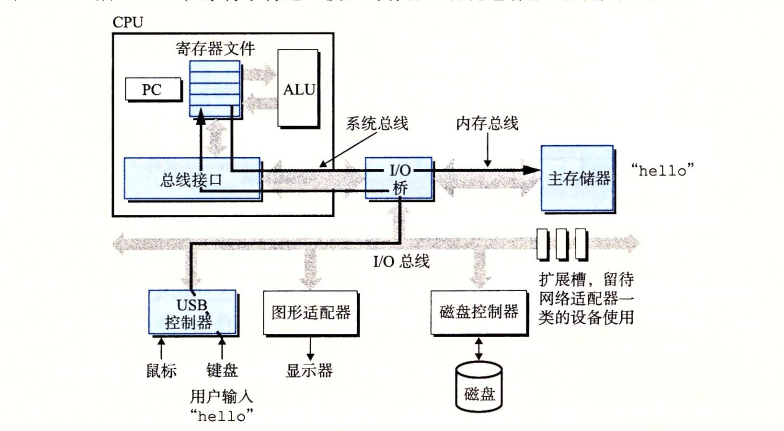

### csapp week 2 总结

- 字节：8个位

- 计算机通过2进制码，进行执行，大部分计算机系统使用ASCII码表示文本字符

- 程序的生命周期

  - 预处理阶段：告诉预处理读取所需的系统头文件，并把它插入到程序文本中，得到完整的程序并生成 .i文件

  - 编译阶段：编译器将文本文件hello.i翻译成文本文件hello.s，它包含一个汇编语言程序

  - 汇编阶段：汇编器将hello.s翻译成机器语言指令，把这些指令打包成可重定位目标程序的格式，并将结果保存在文件hello.o文件中，它是一个二进制文件

  - 链接阶段：程序中调用的其他的函数指令，例如printf函数，它会把预编译好的printf.o以某种方式合并到hello.o程序中去，链接器就负责处理这种合并，结果就得到hello文件，他是一个可以执行文件，可以被加载到内存中，由系统执行

    

  - 把import所需的类插入到程序  -> 编译成汇编代码  -> 汇编代码  -> 二进制代码  -> 链接所需库的预编译文件  ->可执行文件

- 系统的硬件组成

  - 总线：贯穿整个系统，它携带信息字节并负责在各个部件间传递，总线被设计成传送定长的字节块，也就是字，32位4字节，64位8字节
  - I/O设备：输入输出设备是系统与外部的通道，每个I/O设备都通过一个控制器或适配器与I/O总线连接
  - 主存：是一个临时存储设备，用来存放程序和程序处理的数据
  - 处理器：cpu
    - 加载：从主存复制一个字节或者一个字到寄存器，覆盖寄存器原来的内容
    - 存储：从寄存器复制一个字节或一个字到主存的某个位子，覆盖原来的内容
    - 操作：把两个寄存器的内容复制的ALU（算术逻辑单元），ALU对这两个做算术运算，并将结果存放到一个寄存器中，覆盖该寄存器原来的内容
    - 跳转：从指令本身抽取一个字，并将这个字复制到程序计数器（下一条指令）中，已覆盖原来的值

- 运行hello程序

   

  - 加载可执行文件hello，hello中的代码从磁盘复制到主存中

  - 利用直接存储器存取（DMA）

    

  - 一但hello的代码和数据被加载到主存中，处理器就开始执行hello程序的main程序中的机器语言指令，将字符串的字节从主存复制到寄存器，在从寄存器文件复制到显示设备

    

- 高速缓存

  - 程序运行时候，从磁盘复制到主存，主存复制到寄存器，系统设计主要目的就是使这些复制操作尽可能快的完成，针对处理器与与主存之间的差异，采用的更小更快的设备称为高速缓存存储器，作为暂时的集结区域，存放处理器近期可能会需要的信息。
  - 利用高速缓存将程序的性能提高一个数量级，原理就是预先读取数据，用到的时候直接从缓存取。

- 操作系统管理硬件

  - 操作系统有两个基本功能：1.防止硬件失控的应用程序滥用，2.控制复杂的硬件设备，通过几个抽象概念（进程、虚拟内存、文件）

    - 进程：进程是操作系统对一个正在运行的程序的一种抽象，在一个系统上可以运行多个进程，一个进程的指令和另一个进程的指令是交错执行的称为上下文切换

    - 保持跟踪进程运行所需的所有状态信息：上下文，用于恢复进程时候使用（要知道进程执行到哪里了）

      

    - 线程：一个进程中由多个线程的执行单元组成，每个线程都运行在进程的上下文中，并共享同样的代码和全局数据

    - 虚拟内存：它位每个进程提供了一个假象，每个进程都在独占的使用主存，每个进程看到的内存都是一致的，称为虚拟地址空间

      

      地址空间最上面的区域是保留给操作系统中的代码和数据

      地址底部是存放用户进程定义的代码和数据		

      - 程序代码和数据：对于所有进程来说，都是从同一固定位置开始的
      - 堆：运行时候堆，可以动态伸缩
      - 共享库：存放标准库代码和数据的区域
      - 栈：编译器用它来实现函数调用，可伸缩
      - 内核虚拟内存：为内核保留的区域，不允许程序读写这个区域的内容

    - 文件：字节序列

- 系统之间利用网络通信

  

  

- 并发：指一个同时具有多个活动，两个人抢一个厕所

- 并行：一次同时运行多个，两个人同时上厕所，一人一个厕所

- 指令级并行：流水线

- 抽象概念

  

